## Hey, I'm Bogdan 👋

**I make apps. Mostly iOS. Always something I'd use myself.**

Shipping on Apple platforms since 2016 — and lately on the web too.

## Projects

- [gowithme.club](https://gowithme.club) — Your gaming life. All in one place.
- [citycinemadb.com](https://citycinemadb.com) — Every Cinema City showtime in Poland. Plus your Unlimited tracker.
- [tubefold.app](https://tubefold.app) — Less watching. More knowing. YouTube → Markdown.
- [dscontainer.app](https://dscontainer.app) — Your Synology Docker containers. In your pocket.
- [Hardcore Tap](https://apps.apple.com/app/hardcoretap/id1334647124) — One tap per second. Sounds easy.

## GitHub Stats

## Connect

